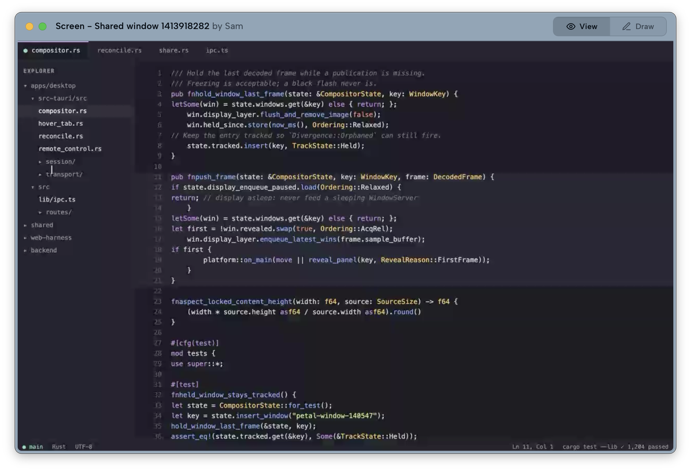
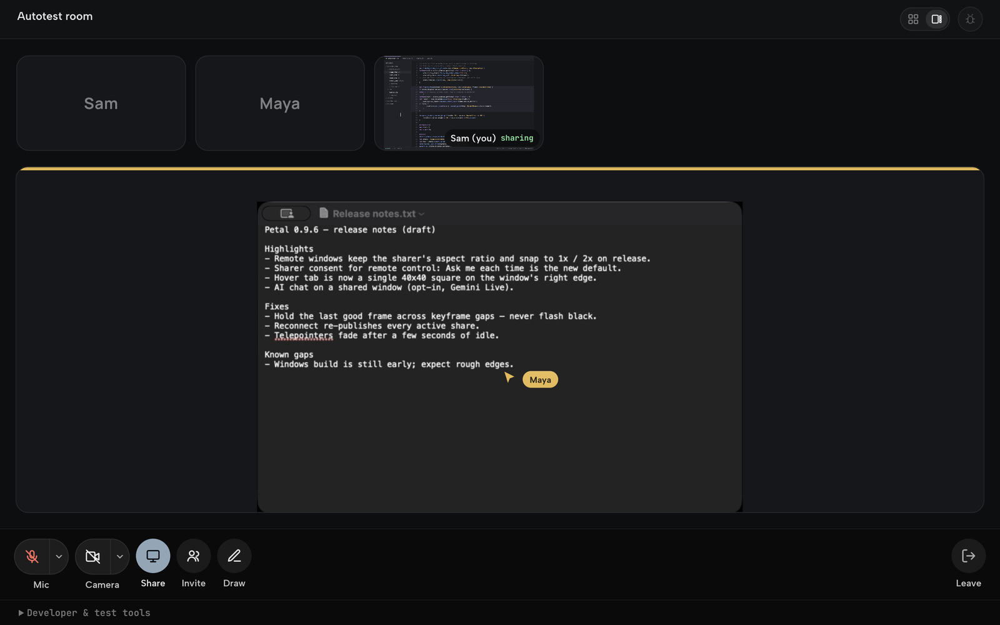

# Petal

**Low-latency, multi-window screensharing for macOS and Windows — built for small
engineering syncs.**

When someone shares a window, it appears on your desktop as a **real, movable,
borderless native window** — not a tile locked in a meeting grid. Move it,
stack it, keep it docked next to your editor while the call keeps going.



**User docs:** [petal.live/docs](https://petal.live/docs/) — install,
permissions, sharing, remote control, self-hosting. This README is for people
who want to build or contribute.

## Status

Petal is young. The macOS app is signed, notarized, and in daily use, but the
project is pre-1.0: interfaces change, some features are further along than
others, and remote control in particular should be treated as early. Windows
support is early: basic sharing (WGC capture, D3D11 compositor, Media
Foundation camera, WASAPI audio, rooms) works, but the platform is still
incomplete and buggy and under active development. An x86-64 Windows NSIS
installer is published unsigned for Authenticode and may trigger SmartScreen;
macOS remains the more mature client. See
[`docs/VALIDATION.md`](docs/VALIDATION.md) for an honest account of what has
been verified and what has not.

## Download

**For macOS** [](https://app.petal.live/api/download?platform=macos)

Always serves the latest signed, notarized universal build.

**For Windows x86-64** [](https://app.petal.live/api/download?platform=windows)

The Windows installer is currently unsigned for Authenticode and may trigger
SmartScreen. Its automatic updates still use Tauri's updater signature.

- **macOS requires:** macOS 13 (Ventura) or later
- **macOS universal:** Apple Silicon and Intel

### Install (macOS)

1. Click **Download** above to get `Petal.dmg`.
2. Open the DMG and drag **Petal** into **Applications**.
3. Launch Petal. On first run it walks you through granting:
   - **Screen Recording** — required, to share windows
   - **Microphone** — required, for audio
   - **Camera** — optional, for your webcam
   - **Accessibility** — optional, only if you want to give/receive remote control

That's it. Petal is notarized, so macOS opens it without any Gatekeeper warnings.

## Features

- **Windows, not tiles** — each shared window is an independent native window on
  your desktop that you can move, resize, and arrange freely.
- **Share several windows at once** — from a hover pill on any window, a picker,
  or a global shortcut (`⌘⌃⇧S`). Each is its own hardware-encoded H.264 stream.
- **Telepointers and drawing** — everyone's cursor shows live over the window
  they're pointing at, and anyone can sketch on a shared window; strokes fade
  after ten seconds.
- **Remote control** — hand a teammate control of a shared window; their clicks
  and keystrokes are injected without stealing your focus. Requires Accessibility
  permission, and by default every request raises a consent prompt on your
  screen (**Ask me each time**; switch to **Allow automatically** or **Off** in
  Settings). See
  [`docs/remote-control-trust-model.md`](docs/remote-control-trust-model.md).
- **AI chat on a shared window** (opt-in) — anyone in the meeting can open a
  live Gemini session about a window being shared: it sees the window, hears
  the room over push-to-talk, and can act on the window only with the
  sharer's explicit approval. Off by default; bring your own key or use the
  hosted mint.
- **Rooms & invites** — persistent named rooms, one-click join, and
  `petal://join/<code>` invite links with live presence.
- **Audio** — mic with echo cancellation and noise suppression, real mute from
  the gallery, floating pill, or menu bar, and device hot-swap.
- **Fits your workflow** — the gallery collapses into a floating pill
  (`⌘⌃⇧P` brings it back), and a menu-bar pill shows mic state, participant
  count, and one-click leave.
- **Resilient** — reconnects across network changes and re-publishes your shares
  automatically.

There's also a **browser client** (`web-harness/`, deployed at
[meet.petal.live](https://meet.petal.live)) so people without the app can join
from a browser by code or invite link.



## Build from source

**Build-host requirements are stricter than runtime requirements.** Petal *runs*
on macOS 13+, but *building* it currently needs the **macOS 26 SDK** (Xcode
26.x): the `apple-metal` crate, pulled in transitively by our vendored
`screencapturekit`, uses Metal APIs that do not resolve against earlier SDKs.
On an older SDK the Swift bridge fails to compile.

Prereqs:

- macOS with **Xcode 26.x** (full Xcode, not just Command Line Tools)
- **Node 20+**
- **Rust** stable
- `livekit-server` (`brew install livekit`) for local meetings

```bash
# 1. local SFU
livekit-server --dev              # ws://localhost:7880 (devkey/secret)

# 2. the desktop app
cd apps/desktop
npm install
PETAL_BACKEND_URL= \
LIVEKIT_URL=ws://localhost:7880 LIVEKIT_API_KEY=devkey LIVEKIT_API_SECRET=secret \
  npm run dev:clean
```

The empty `PETAL_BACKEND_URL=` selects the debug build's local token mint, so
your local LiveKit credentials are the ones used. There is no hosted default:
a build that never sets `PETAL_BACKEND_URL` has no token backend at all, which
is deliberate — a build from this source should never quietly use someone
else's service. Point it at your own with
[`docs/SELF_HOSTING.md`](docs/SELF_HOSTING.md).

Use `npm run dev:clean` (not `tauri build`) for GUI iteration — it keeps the
Screen Recording grant stable across rebuilds. App logs live at
`~/Library/Logs/Petal/petal.log`. Verify a change with `scripts/ci-local.sh`.

### Windows

Prereqs: Windows 10/11, WebView2 runtime (ships with Windows 11), Node 20+,
Rust stable.

```bash
cd apps/desktop
npm install
npm run tauri dev
```

No CLT/Swift recipe or notarization applies on Windows; `scripts/ci-local.sh`
is macOS-only (run `npm run check && npm test` + `cargo test --lib` instead).

Builds from source are **unsigned**, and are not the same artifact as the
notarized download above.

To run Petal against your own LiveKit and token backend rather than the hosted
one, see [`docs/SELF_HOSTING.md`](docs/SELF_HOSTING.md).

## Repo layout

```
petal/
  apps/desktop/    the desktop app (macOS + Windows) — Tauri 2 (Rust core + Svelte 5 SPA)
  web-harness/     the browser client
  backend/         token/rooms API + release distribution (Vercel)
  shared/          UI + logic shared by the desktop app and the browser client
  contracts/       cross-language wire fixtures
  docs/            architecture, contracts, testing, and self-hosting guides
  scripts/         build, verification, and CI helpers
  sbom/            CycloneDX bill of materials + license audit
  site/            the documentation site
```

## Stack

Tauri 2 (Rust core, WKWebView on macOS / WebView2 on Windows) · Svelte 5 + TypeScript · ScreenCaptureKit capture on macOS / Windows.Graphics.Capture on Windows · Media Foundation camera + WASAPI audio on Windows · VideoToolbox H.264 on macOS / D3D11 receiver compositor on Windows · WebRTC over an SFU (LiveKit).

## Contributing

Start with [`CONTRIBUTING.md`](CONTRIBUTING.md), and read
[`docs/ENGINEERING.md`](docs/ENGINEERING.md) before touching native window code
— it documents crash classes that are easy to reintroduce and unpleasant to
debug.

- **Architecture:** [`docs/ARCHITECTURE.md`](docs/ARCHITECTURE.md)
- **Wire contracts:** [`docs/CONTRACTS.md`](docs/CONTRACTS.md)
- **Testing:** [`docs/TESTING.md`](docs/TESTING.md)
- **Security policy:** [`SECURITY.md`](SECURITY.md)
- **What Petal sends over the network:** [`PRIVACY.md`](PRIVACY.md)

## License

Apache-2.0 — see [`LICENSE`](LICENSE), [`NOTICE`](NOTICE), and
[`THIRD_PARTY_NOTICES.md`](THIRD_PARTY_NOTICES.md).

The Petal name and logo are not covered by that grant; see
[`TRADEMARKS.md`](TRADEMARKS.md).
