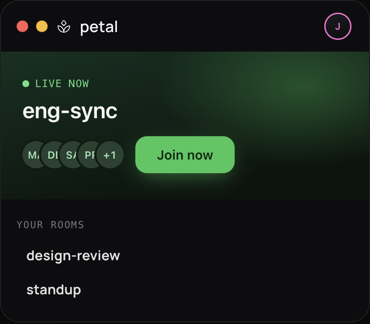
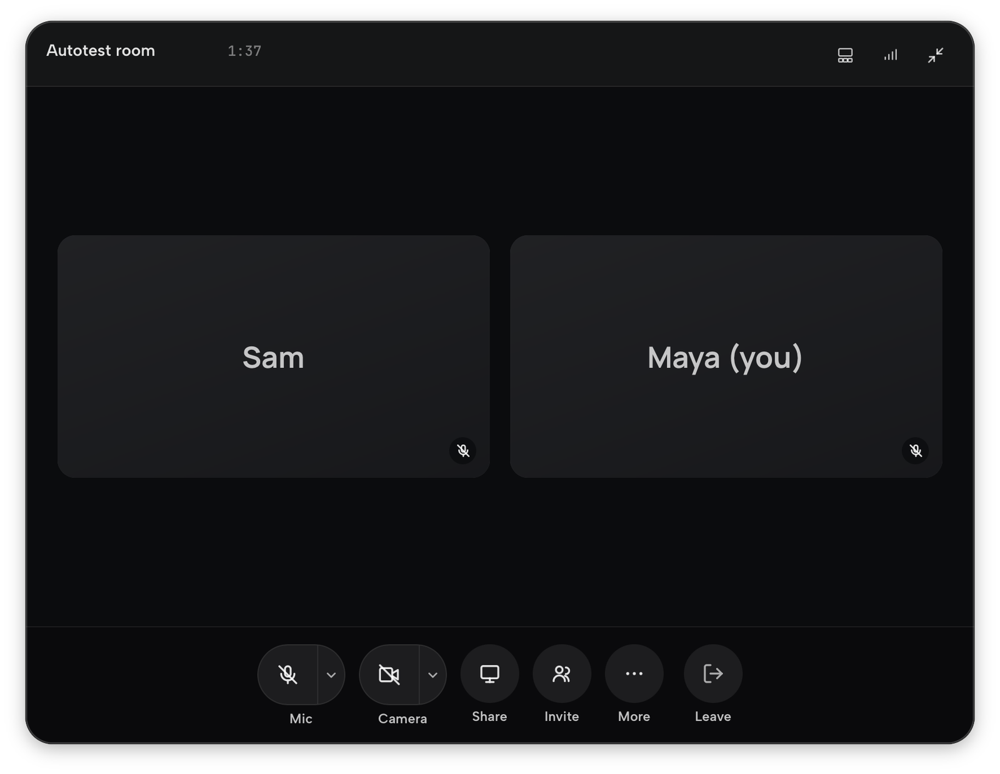
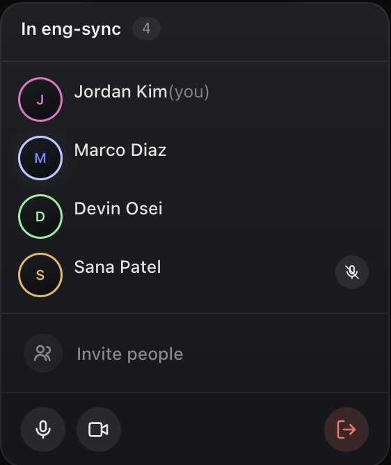

Once permissions are granted, Petal asks for your name and a color to
identify you to others ("Pick your name and color"), then takes you to the
main menu — this is where you create or join meetings.

_The main menu. When one of your rooms is live, it's promoted to the top with
a **Join now** button._

## Creating a meeting

The main menu has a single field ("Enter meeting name or Petal invite") and
a button that reads **Create/Join** while the field is empty. Type a meeting
name (for example, `eng-sync`) and the button reads **Create**. Submitting it
creates a room under that name and takes you in.

Rooms you create are saved to a list on your machine so you can return to
them later without retyping anything.

## The access code

Every room also has a short access code — three groups of lowercase letters
(3, 4, and 3 letters), like `abc-defg-hjk`. This code is what actually lets
someone into the room; the room name is just a friendly label. The code
deliberately skips the letters `i` and `l` so it's harder to misread.

Anyone with the access code can join the room, whether or not they know its
name.

## Sharing an invite

In your room list, every room shows its access code as a small chip. Click
the chip to copy the room's invite link. The link carries the access code
(and a friendly label, when the room has one), so no one has to type a code
by hand: opening the link launches the Petal app straight into the room, and
if Petal isn't installed, the page offers a download and a join-from-the-
browser option instead. Inside a meeting, the bar's **Invite** button copies
the same link.

You can also just share the access code itself (over chat, or out loud) —
anyone who enters it in Petal's meeting field joins the same room.

## Joining a meeting

To join a room someone else created, paste the invite link or type the
access code into the same field on the main menu. Once Petal recognizes it
as a valid code or invite, the button changes to **Join**. Submitting takes
you into the meeting.

## The meeting window

The meeting window shows the room name, a timer, and a tile for each
participant (camera video when it's on, the person's name when it's off).
Along the bottom:

- **Mic** and **Camera** — toggle each; the small arrow beside them picks a
  device.
- **Share** — opens the window picker (see
  [Sharing your windows](/docs/using/sharing-your-windows/)).
- **Invite** — copies the invite link.
- **More** — **Create Petal View** (share a region of your screen) and
  **Disable remote control** / **Allow remote control** for this call.
- **Leave**.

The icons in the top-right switch between the gallery and a spotlight layout,
open the connection stats (Network Cockpit), and **collapse the window to a
compact bar** — a small floating pill with the same controls that stays out
of the way while you work. Expand it again from the pill. On macOS the global
shortcut `⌘⌃⇧P` brings the pill back to the front from anywhere, and
`⌘⌃⇧S` toggles sharing of the window you last shared.

When a teammate starts sharing, a short notice appears at the top-center of
your screen — "*Name* is sharing a window" — with a **Bring to foreground**
action, in case the new window opened behind what you were doing.

## The menu bar pill (macOS)

While you're in a meeting, Petal's menu bar item turns into a green pill
showing your mic state and the participant count, with a one-click leave
button. Click it for a popover with the roster, your recent rooms, the
remote windows currently open on your desktop, and **Settings**.

## What a teammate sees when they join

Once in the meeting, a teammate sees whatever windows you've chosen to
share — each one rendered as its own native window on their desktop, not a
tile in a shared grid. They can move each shared window independently, just
like any other window on their machine. See
[Sharing your windows](/docs/using/sharing-your-windows/) for how sharing works
from the presenter's side, and
[Viewing shared windows](/docs/using/viewing-shared-windows/) for what they
can do with it.
