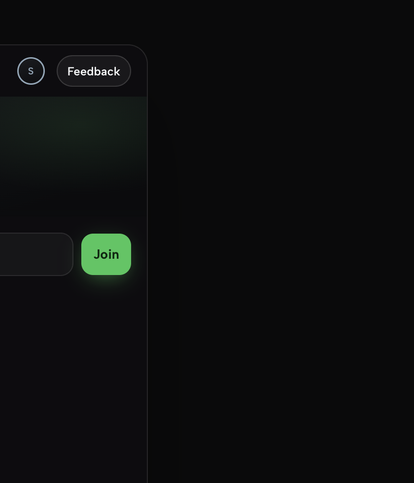

If someone in your meeting doesn't have the Petal desktop app installed —
or is on Linux, or simply prefers not to install it — they can join from a
browser at
[meet.petal.live](https://meet.petal.live) instead. It's a real participant
in the same meeting, not a limited guest mode: real screen sharing, a real
camera, and a real microphone, over the same underlying connection the
desktop app uses.

## Opening an invite link

Petal invite links look like
`https://meet.petal.live/design-review/abc-defg-hjk` — a readable label
plus the meeting's access code. Opening one shows a small Petal page with
platform-aware desktop choices:

- **Open Petal** — hands off to the desktop app if it's installed.
- **Download Petal for macOS** — the universal signed and notarized DMG.
- **Download Petal for Windows** — the x86-64 NSIS installer. The current
  build is unsigned for Authenticode and may trigger SmartScreen.
- **Join in browser** — continues to the browser client and connects you
  to the meeting. If you've never set a display name here before, it asks
  for your name first, then joins.

Both download buttons are always shown; the one matching your operating
system is the primary.

## Joining or creating a meeting by hand

At [meet.petal.live](https://meet.petal.live) there's a single field
("Enter meeting name or Petal invite") and one button, which reads
**Create/Join** until you type:

- Paste a full invite link, a `petal://join/...` link from the desktop app,
  or type an access code like `abc-defg-hjk` — the button reads **Join**.
- Type a plain meeting name instead — the button reads **Create** and
  starts a fresh meeting with that name as its label; the access code is
  generated for you.

Your display name and profile color are set separately: an **Enter your
name** card with a color picker and **Save** appears on your first visit, and
you can reopen it any time from the avatar button ("Edit your profile").
Meetings you've joined before show up in a recent list below the field, with
favorites and one-click rejoin.

## What you can do from the browser

The meeting screen shows a tile grid — one tile per participant, plus a
separate tile for each active screen share — with a control bar along the
bottom:

- **Mic** — publishes your real microphone. The first click asks for
  microphone permission and starts publishing; later clicks mute or unmute.
- **Camera** — publishes your real webcam as a normal camera tile, same as
  the desktop app.
- **Share** — uses your browser's own screen/window/tab picker to share a
  real screen, window, or tab.
- **Invite** — copies an invite link for the current meeting to your
  clipboard.
- **Draw** — toggles drawing mode, so you can sketch on a shared tile;
  everyone in the meeting sees your strokes in your profile color.
- **Leave** — disconnects and returns to the join screen.

The top bar shows the room name (click the pencil to rename it for
everyone), an elapsed timer, a layout switch between the grid and a
**spotlight** view that enlarges one share, and a bug-report button.

A shared window's tile has the same header as the desktop app's windows:
the source and sharer, an **AI chat** button, **Open URL** when the share is
a browser window, and the **View / Control / Draw** modes. Pick **Control**
on a desktop participant's share to request remote control; the sharer's
[consent policy](/docs/using/remote-control/) decides what happens next.

## What's different from the desktop app

The desktop app's signature feature — a shared window rendering as its own
independently movable, borderless native window on everyone else's screen —
only works for participants who are also using the desktop app. If you're
viewing a meeting from a browser, every share (yours or anyone else's)
renders as a tile in the grid, not a floating window. This is a limitation
of what a browser can render, not of what gets shared: a browser
participant's screen share is the same real capture as a desktop share, and
desktop-app participants watching that same share still see it as a native
movable window on their machines.

Two more things a browser can't do: nobody can remote-control a window you
share from a browser (browsers can't inject input into your operating
system, so the **Control** mode isn't offered on your shares), and the
desktop-to-desktop clipboard shortcuts don't apply.

## Access codes are the key, not the label

A meeting's access code is a short letter code like `abc-defg-hjk` (three
groups of letters; easily-confused letters such as `i` and `l` never
appear). The code is what actually identifies and authorizes joining the
meeting:

- The readable label in an invite link
  (`meet.petal.live/design-review/abc-defg-hjk`) is cosmetic — it's there
  for humans. Only the access code part selects the room, so a label alone
  won't get you in.
- Typing or pasting the same access code into the desktop app and into
  meet.petal.live puts you in the same meeting either way.
- When you create a meeting, the access code is generated automatically —
  you only ever need to share the invite link (or the code itself, which is
  short enough to read out loud).
