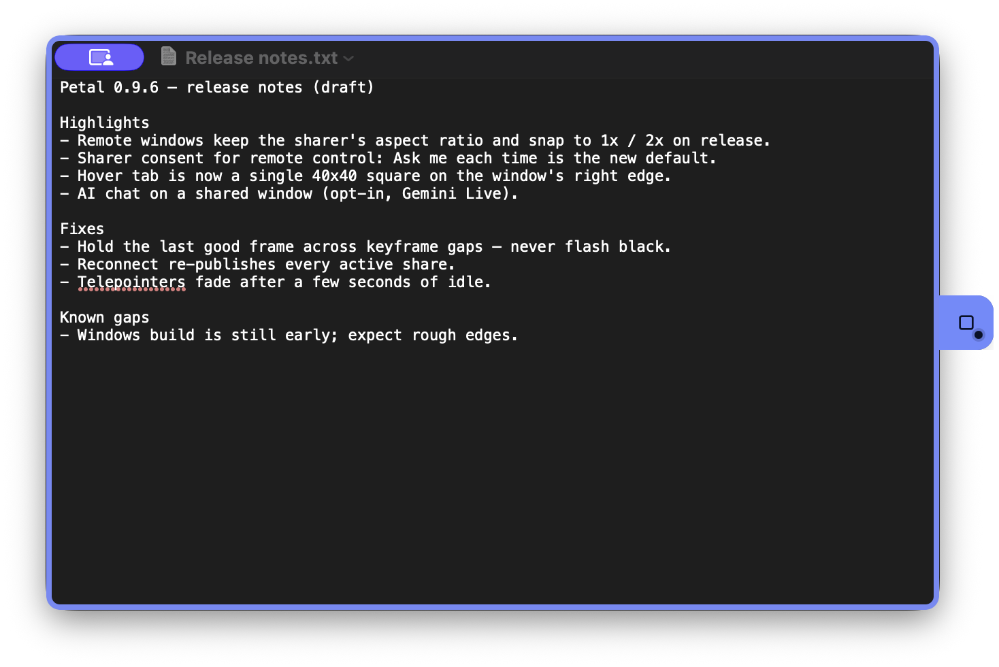
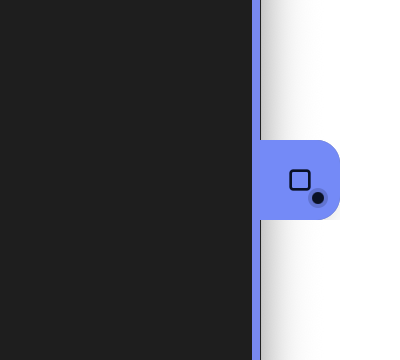

Petal shares individual windows, not your whole screen. You can share more
than one window at a time (up to four), and each one is a separate share
that your teammates can move and resize independently on their own desktops.

_A window you are sharing, seen on your own Mac: the rounded border and the
hover tab are both in your identity color._

## Start sharing with the hover tab

During a meeting, move the pointer over an eligible window to reveal Petal's
40×40 hover tab. Drag the tab along the window's top, right, bottom, or left
edge. It stops just short of each corner; deliberately crossing an endpoint
moves it to the adjacent edge. Click the tab (or press **Enter** or **Space**
when it has focus) to perform the direct action: an unshared window starts
sharing, and a shared window stops sharing. The button is disabled while the
request is pending. Its tooltip and accessible name explain the action,
dragging, and the right-click options menu.

Once a window is shared, Petal draws a rounded border around it on your
screen in your identity color, so you can tell at a glance which of your
windows are live. The tab turns the same color and shows a live marker.
Teammates don't see your local indicator — on their machines, the shared
window itself appears as its own window, with your name and color on its
header (see [Viewing shared windows](/docs/using/viewing-shared-windows/)).

Windows keeps its native gold capture border for every active window capture,
including elevated targets; Petal does not request administrator rights or
replace that system indicator. If the custom indicator cannot be made safe,
sharing still starts with the native system border.

### Move the hover tab

The tab is also a drag surface. Motion below 6px remains a normal Share/Stop
click. Once movement reaches 6px, drag it along the current window edge; it
follows in real time and the click is suppressed. The tab stops just short of
each corner, and deliberately crossing an endpoint moves it to the adjacent
edge. Petal stores one normalized perimeter position, so placement applies to
later windows and survives a restart.

Press **Escape**, cancel the pointer gesture, or let pointer capture be lost
to cancel instead of committing. A missing or malformed saved position safely
returns to the default right-center position. The tab always stays exactly
40×40 and never becomes a free-floating control that covers content.

### The options menu

Right-click the tab to open Petal's system-native sharing-options menu. When
the tab has focus, **Shift+F10** or the keyboard **Menu** key opens the same
menu beside it. Opening the menu never starts or stops sharing. It contains:

- **Screen sharing priority** — see below.
- **Hover tab position** — **Top**, **Right**, **Bottom**, and **Left** edge
  presets, alongside the draggable perimeter placement.
- **Remote control** (Windows only) — **Cursor-preserving (default)** or
  **Full control**, the per-share control mode described in
  [Remote control](/docs/using/remote-control/).
- **Allow remote control** — a per-window lock, enabled only while the window
  is shared. Both the per-window and meeting-wide gates must allow control.
- **Draw on this shared window** / **Stop drawing on this window** — see
  [Telepointers and drawing](/docs/using/telepointers-and-drawing/). Only
  enabled while the window is shared.
- **Start AI chat on this window** / **Stop AI chat on this window** — appears
  only when [AI chat](/docs/using/ai-chat/) is turned on in Settings and the
  window is currently shared.
- **Debug** — opens the Network Cockpit with per-share frame and latency
  statistics.

## Stop sharing

For an ordinary shared window, click its hover tab once. The action is always
**Stop sharing** while it is live, including while Draw is active. To stop
Draw without stopping the share, right-click the tab and choose **Stop drawing
on this window** from the native menu. While Draw is active the tab stays
reachable even after the pointer leaves the window.

Stopping a share closes the window on every teammate's desktop.

## Sharing priority

The options menu offers four **Screen sharing priority** choices:
**Automatic (recommended)**, **Responsive: smoother control**, **Sharp text:
preserve detail**, and **Data saver: 15 fps, slower control**. Petal View
exposes the same choices from its title-bar **Options** button. Picking one
takes effect immediately for an active share when supported, and also becomes
the default for windows you share afterwards. Priority and hover-tab position
are stored together in Petal's sharing-preferences file (they survive a
[factory reset](/docs/using/troubleshooting/#factory-reset)).

## Drawing on a shared window

If you want to point something out visually on a window you're sharing, open
the native options menu and choose **Draw on this shared window**. The entry is
only enabled while the window is actually shared and reads **Stop drawing on
this window** while drawing is active. The hover tab remains fixed; its primary
click still means **Stop sharing**. Everyone viewing that window sees your
strokes live.

## Petal View: share a region of your screen

**Petal View** is a transparent selector you place over any part of your
screen to share a region instead of a whole window. Create one from the
meeting bar's **More** menu (**Create Petal View**). The selector has
persistent **Options**, Share/Stop, and Close controls in its title bar. Use
**Options** for sharing priority, Draw, AI chat, and Debug; it deliberately
has no hover-tab position entries. The hover tab is blocked over the selector
and through its hollow interior. The selector stays high-contrast while idle
and switches to your identity color while shared.

On Windows, an idle Petal View is visible to supported screen recorders such
as OBS, so you can record a demo of its controls. While it is actively shared,
Windows excludes its frame and controls from capture so the selector never
appears in its own shared video; it becomes recordable again after sharing
stops.

## Sharing from the window picker

You can also open the window picker from the meeting bar (the **Share**
control, labelled **Open share picker**): a list of your open windows with
thumbnail previews, where you can start or stop sharing without hunting for
the window on screen. It uses the same share/unshare action as the hover tab,
so the two stay in sync. If nothing is shareable it says so and offers **Try
again**.

## Full-control requests on Windows

Windows starts ordinary window shares in cursor-preserving mode. If a
controller requests full control, the request appears in Petal's
non-activating consent panel with the participant and window name. **Allow**
changes that share to full control; **Deny** leaves it cursor-preserving. The
request expires after 30 seconds and always fails closed. It never resizes or
adds content to the hover tab.
